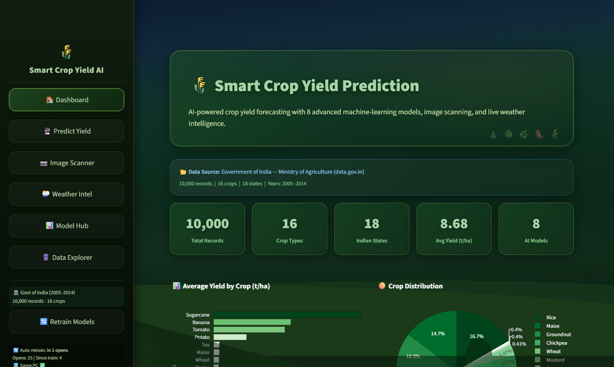
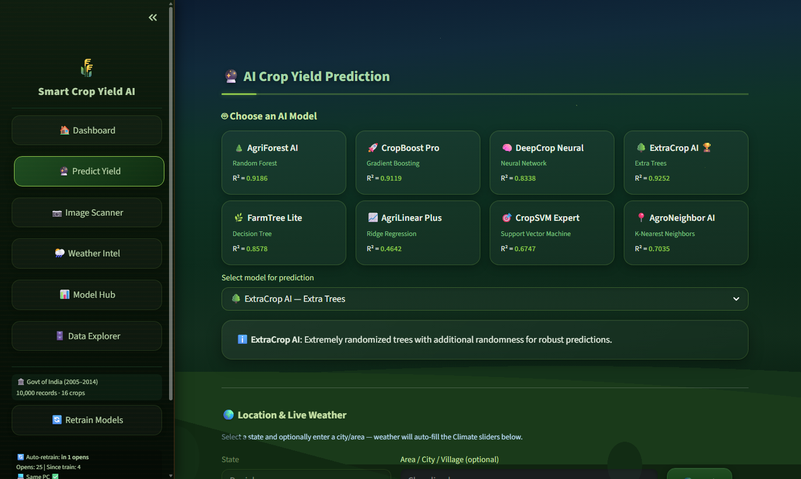
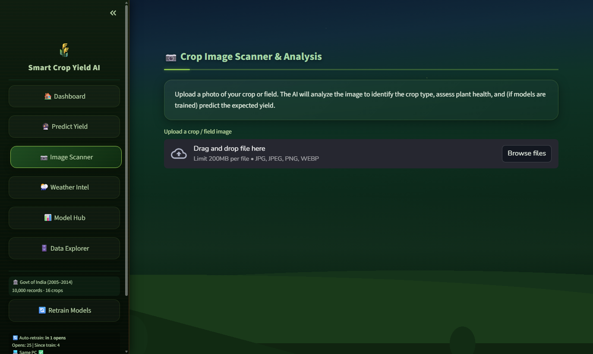
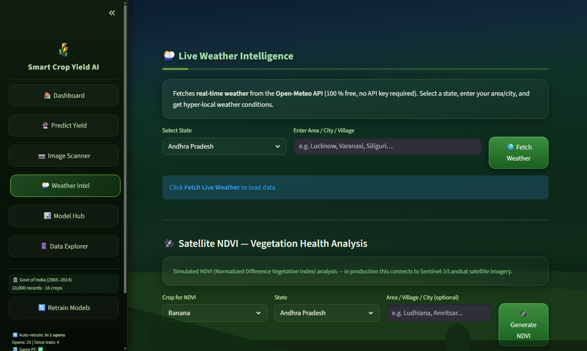
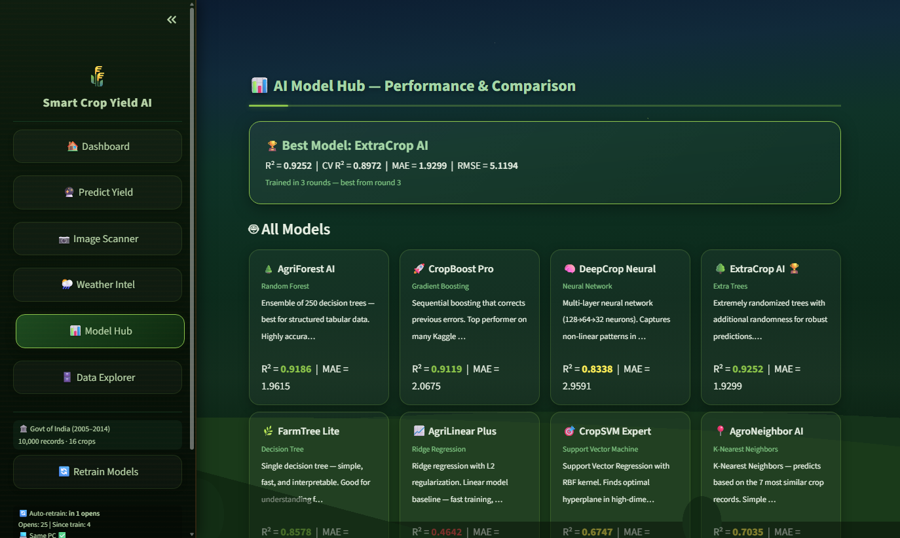
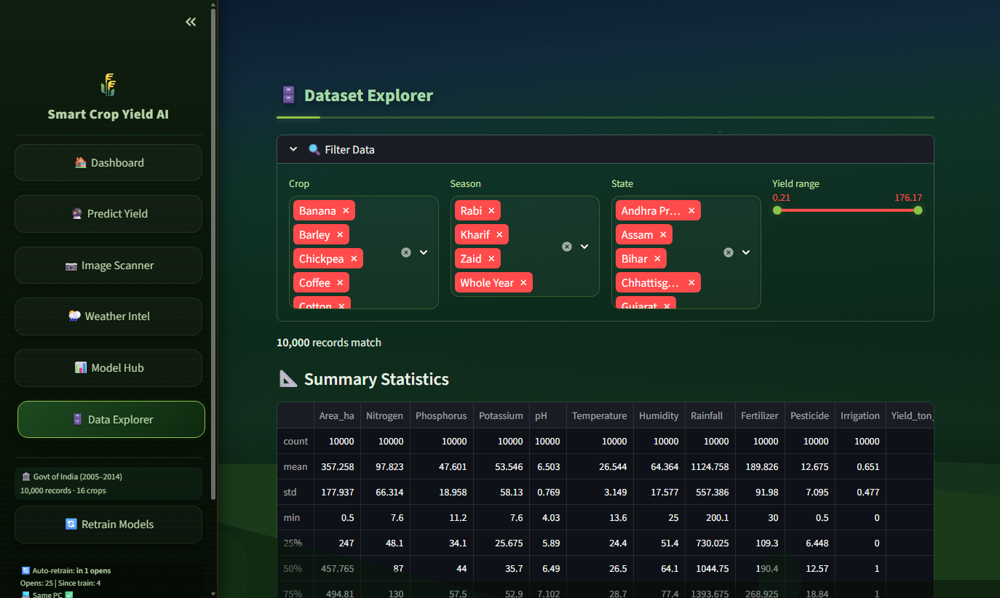

# 🌾 Smart Crop Yield Prediction using AI

<div align="center">


**An intelligent crop yield prediction system powered by 8 AI/ML models, real-time weather data, satellite vegetation analysis, disease detection, and smart farming recommendations.**

*Built for the Indian agricultural ecosystem using Government of India crop production data (data.gov.in)*

[Features](#-features) · [Screenshots](#-screenshots) · [Installation](#-installation) · [Architecture](#-architecture) · [Models](#-ai-models) · [Tech Stack](#-tech-stack)

</div>

---

## 📸 Screenshots

### 🏠 Dashboard
> Real-time KPIs, model performance overview, crop distribution charts, and dataset statistics.



### 🔮 Predict Yield
> Select crop, state, season, and soil parameters. 8 AI models predict yield with confidence scores. Includes auto-fetched live weather, soil health analysis, and smart recommendations.



### 📷 Image Scanner
> Upload crop/field/soil photos for AI-powered analysis — 55+ vegetation indices, GPS extraction, scene classification, disease detection, and health scoring.



### 🌦️ Weather Intel
> Live weather data from Open-Meteo API, NDVI satellite vegetation analysis, rainfall tracking, and crop-specific weather advisories.



### 📊 Model Hub
> Compare all 8 AI models — R² scores, MAE, RMSE, training metrics, and per-model feature importance charts.



### 🗄️ Data Explorer
> Filter, search, and download the 10,000-record dataset. Visualize distributions, correlations, and crop-wise statistics.



---

## ✨ Features

### 🤖 8 AI/ML Models
| Model | Algorithm | Description |
|-------|-----------|-------------|
| **AgriForest AI** | Random Forest (250 trees) | Ensemble of decision trees for robust predictions |
| **CropBoost Pro** | Gradient Boosting | Sequential error-correcting boosted trees |
| **DeepCrop Neural** | MLP Neural Network (128→64→32) | Deep learning with 3 hidden layers |
| **ExtraCrop AI** | Extra Trees Regressor | Extremely randomized trees for variance reduction |
| **FarmTree Lite** | Decision Tree | Single interpretable decision tree |
| **AgriLinear Plus** | Ridge Regression | Regularized linear regression |
| **CropSVM Expert** | Support Vector Regression | Kernel-based non-linear regression |
| **AgroNeighbor AI** | K-Nearest Neighbors (k=7) | Instance-based local prediction |

### 🌿 Crop Image Analysis
- **55+ vegetation indices** — ExG, VARI, NGRDI, GLI, RGRI, MGRVI, and more
- **Scene classification** — Crop field, soil, water, sky, urban, indoor detection
- **GPS extraction** from EXIF metadata with offline reverse geocoding
- **Disease detection** for 5 crops × 4-5 diseases each (Rice, Wheat, Maize, Cotton, Soybean)
- **Health scoring** with severity assessment and treatment recommendations

### 🌦️ Real-Time Weather
- **Open-Meteo API** — Free, no API key required
- Temperature, humidity, precipitation, wind speed
- State & area-level weather lookup with geocoding
- Auto-detect user location via IP geolocation
- Comprehensive offline fallback for all 18 Indian states

### 🛰️ Satellite NDVI Analysis
- Simulated NDVI vegetation index grids
- Health classification (Excellent → Critical)
- Monthly temporal trends
- Land cover fractions (vegetation, water, bare soil)
- Change detection with trend analysis

### 🧪 Soil Health Analysis
- NPK + pH + Organic Carbon analysis
- Overall soil health scoring (0-100)
- Crop suitability ranking for 16+ crops
- Deficiency detection with specific amendment recommendations
- 6 soil type profiles (Alluvial, Black, Red, Laterite, Sandy, Loamy)

### 💡 Smart Recommendations
- Crop management (planting, irrigation, fertilizer, pest control, harvest)
- Soil improvement with deficiency-specific amendments
- Weather-adaptive advisories
- Yield optimization strategies
- Online enrichment via Wikipedia & DuckDuckGo APIs

### 🔄 Auto-Retrain System
- Automatic model retraining triggered by:
  - Every 5 app opens
  - Dataset changes
  - New machine detection
- 3-round tournament training with best-round selection
- Persistent model caching with retrain tracker

---

## 🚀 Installation

### Prerequisites
- Python 3.10 or higher
- pip package manager

### Quick Start

```bash
# Clone the repository
git clone https://github.com/kaone31056789/smart-crop-yield-prediction.git
cd smart-crop-yield-prediction

# Create virtual environment
python -m venv .venv

# Activate virtual environment
# Windows:
.venv\Scripts\activate
# macOS/Linux:
source .venv/bin/activate

# Install dependencies
pip install -r requirements.txt

# Run the app
python -m streamlit run app.py
```

The app will open at `http://localhost:8501`

---

## 🏗️ Architecture

```
┌──────────────────────────────────────────────────────────┐
│                    Streamlit Frontend                     │
│  (app.py - Dashboard, Predict, Scanner, Weather, etc.)   │
├──────────────────────────────────────────────────────────┤
│                                                          │
│  ┌────────────┐  ┌────────────┐  ┌──────────────────┐   │
│  │  model.py   │  │ dataset.py │  │ weather_api.py   │   │
│  │ 8 ML Models │  │ Govt Data  │  │ Open-Meteo API   │   │
│  │ Auto-retrain│  │ + Synthetic│  │ Free, no key     │   │
│  └────────────┘  └────────────┘  └──────────────────┘   │
│                                                          │
│  ┌────────────┐  ┌────────────┐  ┌──────────────────┐   │
│  │ image_     │  │ disease_   │  │ recommendation_  │   │
│  │ analyzer.py│  │ detector.py│  │ engine.py        │   │
│  │ 55+ feats  │  │ MLP per    │  │ KB + Wikipedia   │   │
│  │ PIL+NumPy  │  │ crop       │  │ + DuckDuckGo     │   │
│  └────────────┘  └────────────┘  └──────────────────┘   │
│                                                          │
│  ┌────────────┐  ┌────────────┐  ┌──────────────────┐   │
│  │ soil_      │  │ satellite_ │  │ utils.py         │   │
│  │ analyzer.py│  │ ndvi.py    │  │ Theme, CSS,      │   │
│  │ NPK/pH/OC  │  │ Vegetation │  │ Constants        │   │
│  └────────────┘  └────────────┘  └──────────────────┘   │
│                                                          │
└──────────────────────────────────────────────────────────┘
```

### File Structure

```
├── app.py                    # Main Streamlit UI (6 pages)
├── model.py                  # 8 ML models + auto-retrain system
├── dataset.py                # Govt data download + processing
├── disease_detector.py       # Crop disease detection (MLP per crop)
├── image_analyzer.py         # 55+ feature image analysis pipeline
├── recommendation_engine.py  # Smart recommendations (offline KB + online)
├── satellite_ndvi.py         # NDVI vegetation analysis
├── soil_analyzer.py          # Soil health scoring & crop suitability
├── weather_api.py            # Live weather (Open-Meteo, free)
├── utils.py                  # Theme engine, CSS, constants
├── requirements.txt          # Python dependencies
├── crop_data.csv             # 10,000 processed training records
├── raw_govt_crop_data.csv    # Raw Government of India data
├── saved_models/             # Cached trained models
│   └── retrain_tracker.json  # Auto-retrain state
└── screenshots/              # App screenshots for README
```

---

## 📊 Data Sources

| Source | Description | Access |
|--------|-------------|--------|
| **Government of India** | Crop Production Statistics (data.gov.in) | Free, via GitHub mirror |
| **Open-Meteo** | Weather forecast & geocoding APIs | Free, no API key |
| **DuckDuckGo** | Instant Answer API for recommendations | Free, no API key |
| **Wikipedia** | REST API for crop information | Free, rate-limited |
| **ip-api.com** | IP-based geolocation | Free for non-commercial |

---

## 🛠️ Tech Stack

| Category | Technology |
|----------|-----------|
| **Frontend** | Streamlit 1.30+ with custom CSS (glassmorphism theme) |
| **ML/AI** | scikit-learn (RF, GBR, MLP, ExtraTrees, SVM, KNN, Ridge, DT) |
| **Data** | Pandas, NumPy |
| **Visualization** | Plotly Express (interactive charts) |
| **Image Processing** | Pillow (PIL) + NumPy |
| **Model Persistence** | joblib |
| **HTTP** | requests |

**Zero paid API dependencies.** All external APIs used are free tier with no API keys required.

---

## 🌱 Supported Crops

Rice, Wheat, Maize, Cotton, Soybean, Sugarcane, Barley, Groundnut, Mustard, Potato, Tomato, Onion, Jute, Tea, Coffee, Millet

---

## 📜 License

This project is licensed under the MIT License.

---

## 👤 Author

**Parikshit** — B.Tech Semester 4 Mini Project

---

<div align="center">

*Made with ❤️ for Indian Agriculture*

</div>
